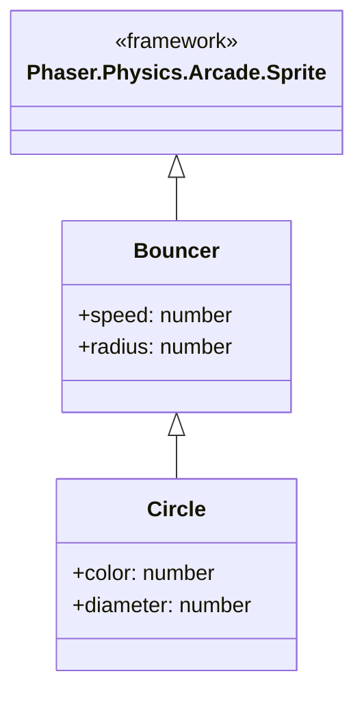

Hosted at:  https://keithrieck.github.io/sdd_openspec_bouncer/index.html

# sdd_openspec_bouncer

This trivial project was developed with [OpenSpec](https://openspec.pro/) and [Codex](https://chatgpt.com/codex/enterprise/).  The model I'm using is gpt-5.3-Codex at the Medium level and standard speed.  I'm editing things in Visual Studio Code.

In a previous project I created specification in the file [`spec-v001.md`](spec-v001.md), using two agent skills:  [`grill-me`](.codex/skills/grill-me/SKILL.md) and [`spec-writer`](.codex/skills/spec-writer/SKILL.md).  When developing graphics programs, I use my [`phaser-game`](.codex/skills/phaser-game/SKILL.md) to set up the [Phaser](https://phaser.io/) game stuff.

## First Iteration

1. After installing OpenSpec and creating my project directory, 
  * execute: `openspec init`     Specify that I'm using Codex.
  * I add the `phaser-game` skill under `.codex/skills`.
  * Copy in the file `spec-v001.md` which I'd created earlier with `grill-me` and `spec-writer`
  * I update [`config.yaml`](openspec/config.yaml) to specify the Tech stack.
2. From within Codes, execute `Openspec Explore`.  This goes into "explore" mode.  I indicate that I  want to "Explore an idea".  Within this chat, tell Codex what we want.
  * `Create a web app showing 64 circles bouncing across the page using the information in spec-v001.md and treat this as a Progressive Web Application and Phaser game using $phaser-game conventions`
3. From within Codex, execute `Openspec Propose`
    * Creates [proposal.md](openspec/changes/bouncing-circles-web-app/proposal.md)
    * Creates [spec.md](openspec/changes/add-bouncing-circles-pwa-phaser/specs/bouncing-circles-simulation/spec.md)
    * Creates [design.md](openspec/changes/bouncing-circles-web-app/design.md)
    * Creates [tasks.md](openspec/changes/bouncing-circles-web-app/tasks.md)
4. Review the documents and make necessary changes.
5. From within Codex, execute `Openspec Apply Change`
    * Code is generated.  I test it locally and it works. 
    * Code should be reviewed at this point.  Problems could be either fixed manually or you could tell Codes what to correct.
    * Everything is commited to a 'master' branch.  It all gets published to Github and I configure Github Pages to host the app.

## Second Iteration

1. Create a feature branch named `small_circles`.
2. In Codex, start the Explore mode again.
* 

## References:
* [OpenSpec](https://openspec.pro/)
* [OpenSpec in Github](https://github.com/Fission-AI/OpenSpec)
* [How I Use OpenCode, Oh-My-OpenCode-Slim, and OpenSpec to Build My Own AI Coding Environment](https://www.dataleadsfuture.com/how-i-use-opencode-oh-my-opencode-slim-and-openspec-to-build-my-own-ai-coding-environment/)